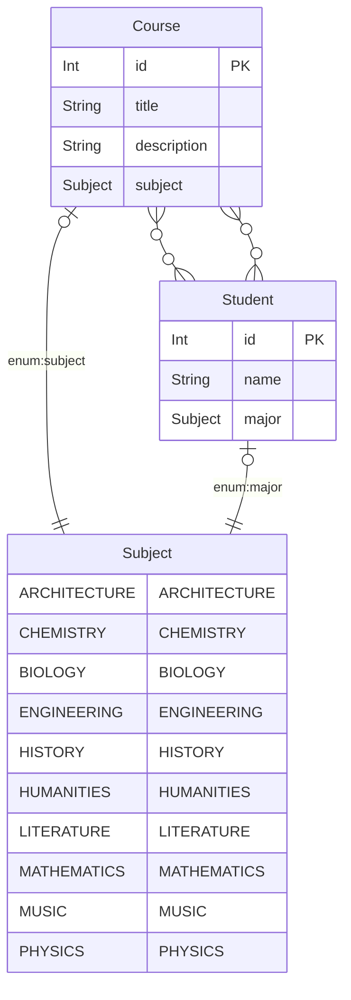

# How To Perform Nested Writes with RedwoodJS and GraphQL

One of the common question asked in the RedwoodJS Discord community concerns what Prisma calls [nested writes](https://www.prisma.io/docs/concepts/components/prisma-client/transactions#nested-writes).

> A nested write lets you perform a single Prisma Client API call with multiple operations that touch multiple related records. For example, creating a user together with a post or updating an order together with an invoice. Prisma Client ensures that all operations succeed or fail as a whole.

The questions are not so much about how do I perform the nested write using Prisma, but

- Should I just reuse the existing "C" in the generated "CRUD" services and input types? (Spoiler: I say no)
- What data do I send from the the web side/form in the GraphQL request
- What does the SDL (Input and Operation/Mutation) look like?
- What does the service/Prisma create look like?

## Practical Example

Let's look at a practical example where we have Courses and Students and Students can enroll in many Courses.

### Entity Relationship Diagram



> Note: Want to generate diagrams like this? See how the [prisma-erd-generator](./api/db/schema.prisma) is setup in the Prisma schema. You can generate mermaid, png and svg diagrams.

### How do I create a new Course and assign existing students?

Given a number of existing Students, let's launch a new Course and enroll several students in one create (mutation).

We wont use any existing generators or CRUD types or services; instead we will create a dedicated GraphQL mutation that is purposeful for the task of creating a Course and assigning students ... and only that.

This way, we can also better control authorization (perhaps only certain roles can launch a new course with students, but other roles can create empty courses) as well as validate the information if needed (maybe a course can only be launched it 5 students signed up right away), etc.

#### SDL

In [launchCourse.sdl.ts](2022-10-26-nested-writes-demo/api/src/graphql/launchCourse.sdl.ts) we define the input types and the mutation.

We want the `StudentEnrollInput` to be an object like: `{id: 3}` where id is the Student id.

Then `LaunchCourseInput` has a `course` which is the `CreateCourseInput` (meaning it has the fields to create a new Course like `title` and `description`) and `studentIds` which is an array of objects with a student id like: `[{id: 2}, {id: 3}, {id: 5}]`.

And lastly, the mutation to `launchCourse` which needs the `LaunchCourseInput` data and will return the newly created `Course`. This is performed by the `launchCourse` service.

```ts
// 2022-10-26-nested-writes-demo/api/src/graphql/launchCourse.sdl.ts
export const schema = gql`
  input StudentEnrollInput {
    id: Int!
  }

  input LaunchCourseInput {
    course: CreateCourseInput!
    studentIds: [StudentEnrollInput!]!
  }

  type Mutation {
    launchCourse(input: LaunchCourseInput!): Course! @requireAuth
  }
`
```

### Service

The `launchCourse` service receives the data needed to create a new Course and enroll several students in the GraphQL request having set the `LaunchCourseInput` information.

It used a "nested write" to:

- create the Course by spreading the data in `input.course` (title, description, etc.)
- connects this Course to several students using their primary key id

```ts
// 2022-10-26-nested-writes-demo/api/src/services/launchCourses/launchCourse.ts

import type { QueryResolvers, MutationResolvers } from 'types/graphql'

import { db } from 'src/lib/db'

export const launchCourse: MutationResolvers['launchCourse'] = ({ input }) => {
  return db.course.create({
    data: { ...input.course, students: { connect: input.studentIds } },
    include: { students: true },
  })
}
```

### Make the Request

1. Launch the dev server using `yarn rw dev`
1. Visit the Redwood GraphQL Playground at http://localhost:8911/graphql
1. Make the mutation and notice the input values

```json
mutation {
  launchCourse(
    input: {
      course: {
        title: "The Works of Frank Lloyd Wright",
        description: "In this course we will explore the works of the American architect, designer, writer, and educator.",
      	subject: ARCHITECTURE
      },
      studentIds: [{id: 2}, {id: 3}, {id: 5}]
      }) {
    id
    title
    description
    subject
    students {
      id
      name
      major
    }
  }
}
```

And the response should return the newly created course with the enrolled students.

```json
{
  "data": {
    "launchCourse": {
      "id": 17,
      "title": "The Works of Frank Lloyd Wright",
      "description": "In this course we will explore the works of the American architect, designer, writer, and educator.",
      "subject": "ARCHITECTURE",
      "students": [
        {
          "id": 2,
          "name": "Leland Brakus",
          "major": "LITERATURE"
        },
        {
          "id": 3,
          "name": "Paolo Kerluke",
          "major": "MUSIC"
        },
        {
          "id": 5,
          "name": "Kody Mitchell",
          "major": "BIOLOGY"
        }
      ]
    }
  }
}
```

## Future Next Steps

- Validate input (maybe 5 students needed to launch new course)
- Handle Prisma errors if connected student does not exist and return a friendly error
- Have a `createOrConnect` to also add a new Student
- Optimize resolvers to avoid fetching multiple students

---

# README

Welcome to [RedwoodJS](https://redwoodjs.com)!

> **Prerequisites**
>
> - Redwood requires [Node.js](https://nodejs.org/en/) (>=14.19.x <=16.x) and [Yarn](https://yarnpkg.com/) (>=1.15)
> - Are you on Windows? For best results, follow our [Windows development setup](https://redwoodjs.com/docs/how-to/windows-development-setup) guide

Start by installing dependencies:

````

yarn install

```

Then change into that directory and start the development server:

```

cd my-redwood-project
yarn redwood dev

````

Your browser should automatically open to http://localhost:8910 where you'll see the Welcome Page, which links out to a ton of great resources.

> **The Redwood CLI**
>
> Congratulations on running your first Redwood CLI command!
> From dev to deploy, the CLI is with you the whole way.
> And there's quite a few commands at your disposal:
>
> ```
> yarn redwood --help
> ```
>
> For all the details, see the [CLI reference](https://redwoodjs.com/docs/cli-commands).

## Prisma and the database

Redwood wouldn't be a full-stack framework without a database. It all starts with the schema. Open the [`schema.prisma`](api/db/schema.prisma) file in `api/db` and replace the `UserExample` model with the following `Post` model:

````

model Post {
id Int @id @default(autoincrement())
title String
body String
createdAt DateTime @default(now())
}

```

Redwood uses [Prisma](https://www.prisma.io/), a next-gen Node.js and TypeScript ORM, to talk to the database. Prisma's schema offers a declarative way of defining your app's data models. And Prisma [Migrate](https://www.prisma.io/migrate) uses that schema to make database migrations hassle-free:

```

yarn rw prisma migrate dev

# ...

? Enter a name for the new migration: › create posts

```

> `rw` is short for `redwood`

You'll be prompted for the name of your migration. `create posts` will do.

Now let's generate everything we need to perform all the CRUD (Create, Retrieve, Update, Delete) actions on our `Post` model:

```

yarn redwood g scaffold post

```

Navigate to http://localhost:8910/posts/new, fill in the title and body, and click "Save":

Did we just create a post in the database? Yup! With `yarn rw g scaffold <model>`, Redwood created all the pages, components, and services necessary to perform all CRUD actions on our posts table.

## Frontend first with Storybook

Don't know what your data models look like?
That's more than ok—Redwood integrates Storybook so that you can work on design without worrying about data.
Mockup, build, and verify your React components, even in complete isolation from the backend:

```

yarn rw storybook

```

Before you start, see if the CLI's `setup ui` command has your favorite styling library:

```

yarn rw setup ui --help

```

## Testing with Jest

It'd be hard to scale from side project to startup without a few tests.
Redwood fully integrates Jest with the front and the backends and makes it easy to keep your whole app covered by generating test files with all your components and services:

```

yarn rw test

```

To make the integration even more seamless, Redwood augments Jest with database [scenarios](https://redwoodjs.com/docs/testing.md#scenarios) and [GraphQL mocking](https://redwoodjs.com/docs/testing.md#mocking-graphql-calls).

## Ship it

Redwood is designed for both serverless deploy targets like Netlify and Vercel and serverful deploy targets like Render and AWS:

```

yarn rw setup deploy --help

```

Don't go live without auth!
Lock down your front and backends with Redwood's built-in, database-backed authentication system ([dbAuth](https://redwoodjs.com/docs/authentication#self-hosted-auth-installation-and-setup)), or integrate with nearly a dozen third party auth providers:

```

yarn rw setup auth --help

```

## Next Steps

The best way to learn Redwood is by going through the comprehensive [tutorial](https://redwoodjs.com/docs/tutorial/foreword) and joining the community (via the [Discourse forum](https://community.redwoodjs.com) or the [Discord server](https://discord.gg/redwoodjs)).

## Quick Links

- Stay updated: read [Forum announcements](https://community.redwoodjs.com/c/announcements/5), follow us on [Twitter](https://twitter.com/redwoodjs), and subscribe to the [newsletter](https://redwoodjs.com/newsletter)
- [Learn how to contribute](https://redwoodjs.com/docs/contributing)
```
````
