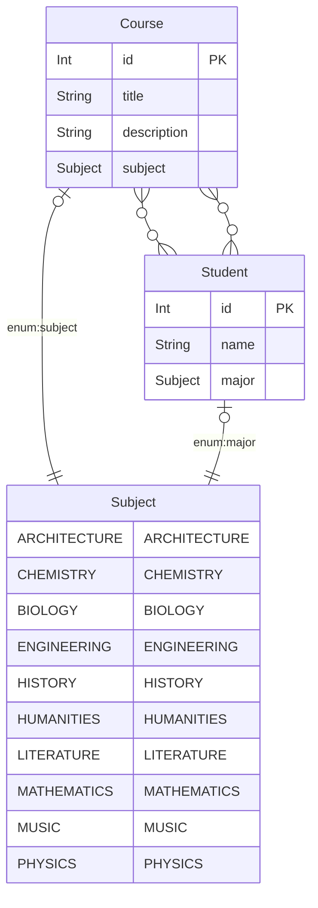

```mermaid
erDiagram

        Subject {
            ARCHITECTURE ARCHITECTURE
CHEMISTRY CHEMISTRY
BIOLOGY BIOLOGY
ENGINEERING ENGINEERING
HISTORY HISTORY
HUMANITIES HUMANITIES
LITERATURE LITERATURE
MATHEMATICS MATHEMATICS
MUSIC MUSIC
PHYSICS PHYSICS
        }
    
  Course {
    Int id PK 
    String title  
    String description  
    Subject subject  
    }
  

  Student {
    Int id PK 
    String name  
    Subject major  
    }
  
    Course o|--|| Subject : "enum:subject"
    Course o{--}o Student : ""
    Student o|--|| Subject : "enum:major"
    Student o{--}o Course : ""
```
